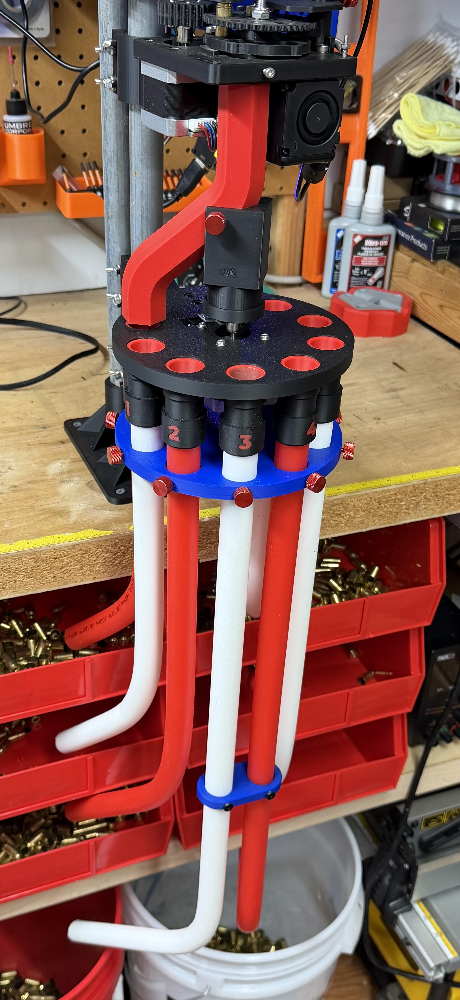

# Sorter manifold — printable replacement parts

Replacement output plumbing for the [CS7.2](https://github.com/sjseth/AI-Case-Sorter-CS7.2)
sorter: a new sorter base, sort pipes, and drop-in funnels. The base
routes each of the eight sorter ports into **1" hose** by default, and
the included adapters convert any port to **3/4" PEX tubing** instead —
run rigid PEX to your bins, or hose where you need the flexibility.

> **Experimental parts.** These have been running fine on the
> reference machine for a while, but your mileage may vary. Printed in
> PLA at 0.2 mm layers with 4 walls.

## Parts

| File | Print | What it is |
|---|---|---|
| `Sorter Base Manifold.stl` | ×1 | The sorter base — eight output ports, sized for 1" hose out of the box |
| `Manifold Pex adapter 0.stl` … `7.stl` | ×1 each, as needed | Port-specific adapters (numbered to match the base's eight ports) that convert a 1" port to 3/4" PEX |
| `Sort Pipe Double Curve.stl` | ×1 | Sort pipe, large opening all the way through |
| `Sort Pipe Double Curve 9mm.stl` | ×1 | Sort pipe with a smaller funnel-style output for 9mm |
| `9mm funnel.stl` | ×8 | Drop-in funnels that reduce the sorter base's hole openings for 9mm — they keep cases from turning sideways and jamming |
| `Smaller 9mm Funnel.stl` | ×8 | Tighter variant of the drop-in funnel |
| `Sorter 1in Hose Support.stl` | ×1 | Support bracket for 1" hose runs |
| `Sorter PEX Support.stl` | ×1 | Support bracket for PEX runs |

Pick **one** sort pipe and **one** funnel style for 9mm setups; the
funnels simply drop into the sorter base holes. The PEX adapters are
per-port — print only the ports you're converting.

These parts replace the stock CS7.2 base and sort pipe; everything
else about the machine is unchanged. Nothing here is required by the
SortIQ software — bins are bins.
